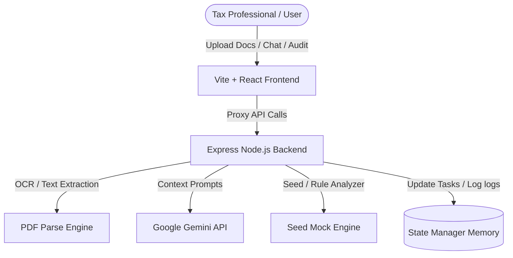

# TaxPulse AI – Intelligent Tax Regulation Monitoring & Compliance Agent

TaxPulse AI is a premium enterprise-grade AI web application tailored for tax consultants, compliance officers, finance teams, and advisory firms (like EY, Deloitte, PwC, KPMG) to autonomously monitor tax law changes, analyze business impacts, and coordinates compliance actions.

---

## 🌟 Key Features

1. **Executive Compliance Console**: Visual KPI metric cards, compliance index progress meter, high-priority smart alerts, and immediate action reminders.
2. **AI Tax Monitoring Agent**: Drag-and-drop document upload (PDF, DOCX, TXT, scanned images) with autonomous parameter extraction (Authority, Effective Date, Risk Level, Compliance Requirements).
3. **Structured Business Impact Analysis**: Auto-determines operational, accounting, finance, tax, and IT/ERP (SAP tax codes mapping) modifications needed.
4. **Interactive Clause Comparison**: Split-pane Git-style visual diff viewer highlighting additions, modifications, and deletions between regulation versions.
5. **Workflow Coordinator & Audit Trail**: Convert recommendations into assigned checklist items, change task statuses, log audit verification notes, and export comprehensive audit sheets to CSV.
6. **Cost of Non-Compliance Simulator**: Interactive sliders (Turnover, Invoices Volume, Avg Tax Amount) estimating potential penalty liabilities and Input Tax Credit (ITC) risks.
7. **AI Memo Template Generator**: Draft professional summaries tailored for the Board of Directors, Finance Team, or ERP systems administrators.
8. **Contextual AI Chat Assistant**: Consult with the AI agent regarding specific regulations, ask custom questions, or use preset compliance query prompts.

---

## 🏗️ Architecture & Tech Stack



- **Frontend**: React, Vite, Lucide-React (Icons), Recharts (Visualizations), Vanilla CSS Custom Properties (Theme Control).
- **Backend**: Node.js, Express, Multer (Upload handling), PDF-Parse (Text extraction), Google Generative AI SDK (Gemini Integration).

---

## 📁 Repository Structure

```
TaxPulse-AI/
├── package.json                   # Root orchestrator scripts (Dev concurrently)
├── .env                           # API Key configuration
├── .gitignore
├── README.md
├── backend/
│   ├── package.json               # Backend dependencies
│   ├── server.js                  # Express API router & file handlers
│   ├── seedData.json              # Pre-seeded tax regulations & history
│   └── uploads/                   # Temporary directory for uploaded files
└── frontend/
    ├── package.json               # Frontend dependencies
    ├── vite.config.js             # Vite proxy setting
    ├── index.html
    └── src/
        ├── main.jsx               # Entry point
        ├── App.jsx                # Layout orchestrator
        ├── context/
        │   └── TaxContext.jsx     # Global state provider
        ├── styles/
        │   ├── index.css          # Design tokens & variables
        │   ├── dashboard.css      # Core grid shell layouts
        │   ├── components.css     # Cards, chat bubbles, diff tables
        │   └── animations.css     # Spinners and micro-transitions
        ├── components/
        │   ├── Sidebar.jsx
        │   ├── Header.jsx
        │   ├── DashboardView.jsx
        │   ├── AIMonitorView.jsx
        │   ├── ChatView.jsx
        │   ├── CalendarView.jsx
        │   ├── CompareView.jsx
        │   ├── WorkflowView.jsx
        │   ├── CalculatorView.jsx
        │   └── AnalyticsView.jsx
        └── utils/
            └── reportExporter.js  # CSV & Text export utilities
```

---

## 🚀 Getting Started

### 1. Requirements
Ensure you have **Node.js (LTS version)** installed on your machine.

### 2. Installation
Run the following command in the root folder to install dependencies for the root, backend, and frontend:
```bash
npm run install:all
```

### 3. Setup Environment Variables
Create a `.env` file in the root directory (or update the existing template):
```env
GEMINI_API_KEY=your_gemini_api_key_here
PORT=3000
```
*Note: If no `GEMINI_API_KEY` is provided, the application runs in **Interactive Demo Mode**, utilizing seeded tax regulations and a mock generator to simulate deep tax analyses.*

### 4. Running the App
Start both backend and frontend concurrently in development mode:
```bash
npm run dev
```

Open your browser and navigate to:
- **Frontend Dashboard**: [http://localhost:5173/](http://localhost:5173/)
- **Backend Express Server**: [http://localhost:3000/](http://localhost:3000/)

---

## 📝 Compliance Audit Verification Log (Audit Trail)
TaxPulse AI maintains a complete history log for every task:
- Every status adjustment from **Pending** to **Completed** prompts the auditor for notes.
- Logs include timestamps and auditor names, serving as direct evidence sheets for auditors or CFO offices.
- Track sheets can be exported to spreadsheet-compatible **CSV formats** instantly.
